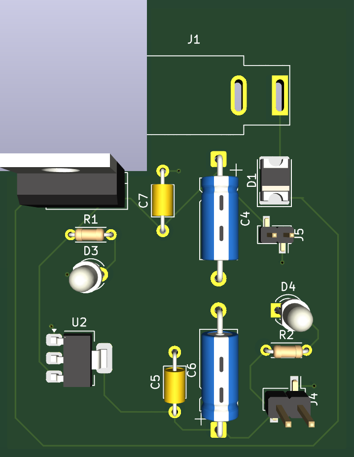
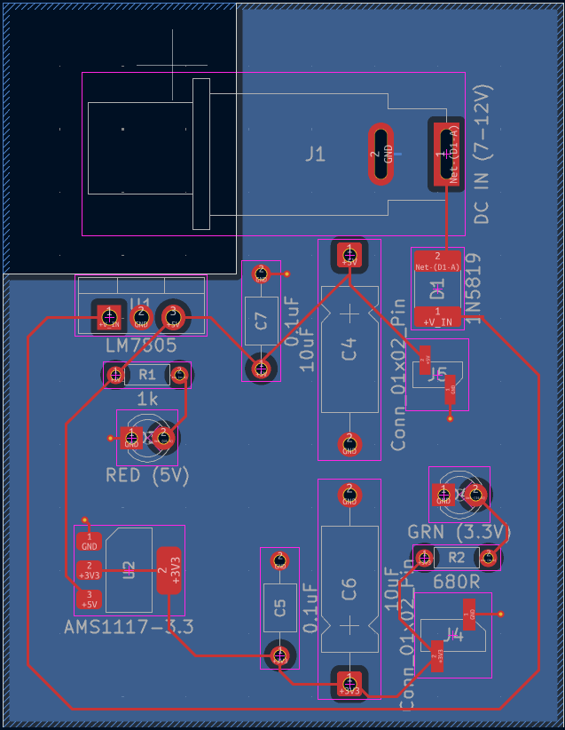

# Dual Supply 5V & 3.3V Power Supply PCB

A custom PCB designed in **KiCad** that provides regulated **5V and 3.3V DC power outputs** from a **7–12V DC input**.

The board uses an **LM7805 linear regulator** to generate the 5V rail and an **AMS1117-3.3 regulator** to generate the 3.3V rail. Status LEDs are provided to indicate the availability of both regulated outputs.

## PCB 3D View

<p align="center">
  
</p>

## PCB Layout

<p align="center">
  
</p>

---

## Features

- 7–12V DC input
- Regulated +5V output
- Regulated +3.3V output
- LM7805 5V linear regulator
- AMS1117-3.3 voltage regulator
- Reverse-polarity/input protection using 1N5819 Schottky diode
- Power indicator LED for 5V
- Power indicator LED for 3.3V
- Input and output filtering capacitors
- Through-hole and SMD components
- Custom PCB layout designed in KiCad
- KiCad 10 project files included

---

## Block Diagram

```text
              7–12V DC INPUT
                    │
                    ▼
             ┌──────────────┐
             │  1N5819      │
             │ Schottky     │
             │ Protection   │
             └──────┬───────┘
                    │
                    ▼
             ┌──────────────┐
             │   LM7805     │
             │   5V Reg.    │
             └──────┬───────┘
                    │
              +5V OUTPUT
                    │
             ┌──────┴───────┐
             │              │
          RED LED            │
             │              ▼
             │       ┌──────────────┐
             │       │ AMS1117-3.3  │
             │       │ 3.3V Reg.    │
             │       └──────┬───────┘
             │              │
             │        +3.3V OUTPUT
             │              │
             │         GREEN LED
             │
             ▼
           GND
